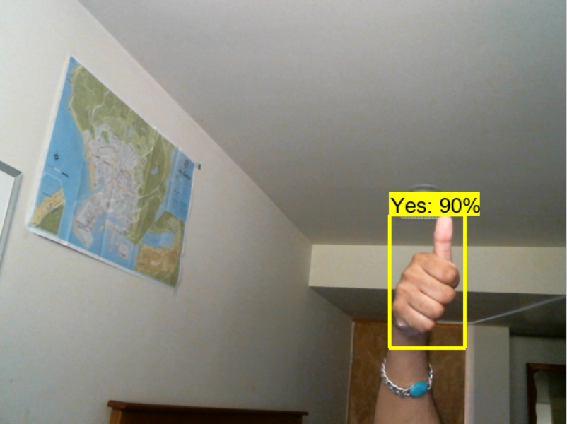
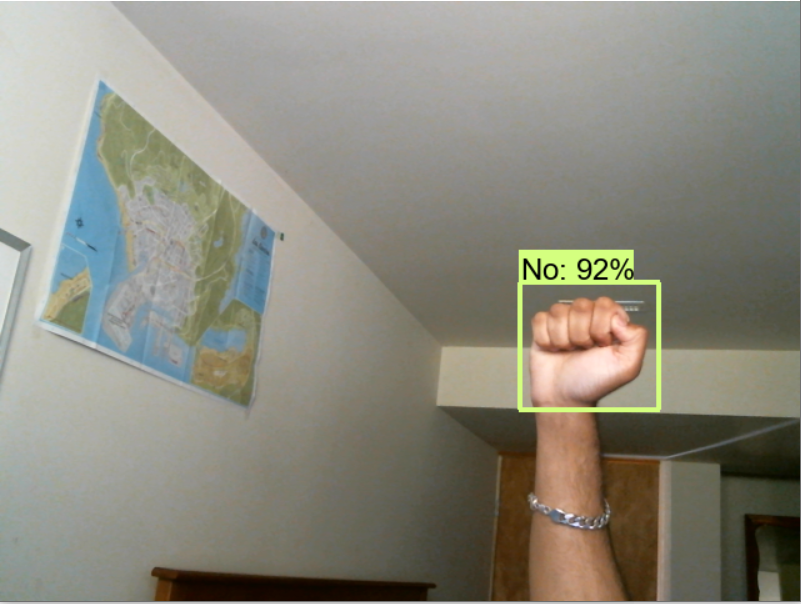
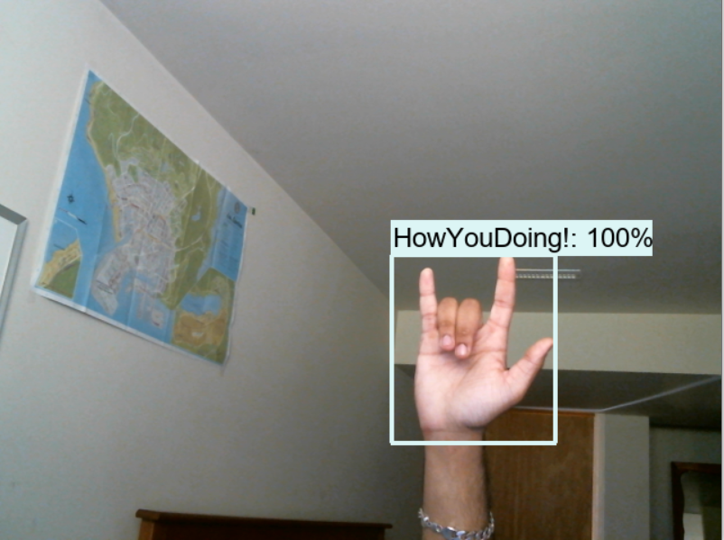
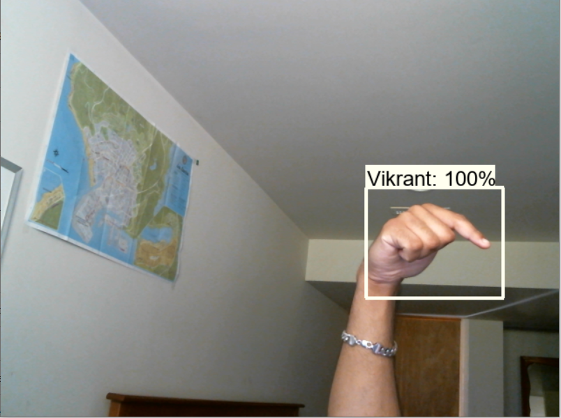

# Hand Sign Recognition


 Hand Sign Recognition is a sign language detector that detects hand signs in real time and labels the movement.
 
 How it works:
```
- First, all the input images were labeled with bounding boxes using Label Image.
- Then trained object detector on the labeled images with transfer learning on existing Tensorflow object detector.
- At last, doing real-time object detection using OpenCV and python with a webcam.
```
<br>

## How to run the webapp on local machine:
- install python
- git clone the project and run the cells in tutorial.ipynb
- the last cell will launch the openCV cam to do real time hand sign detections

## Output:



